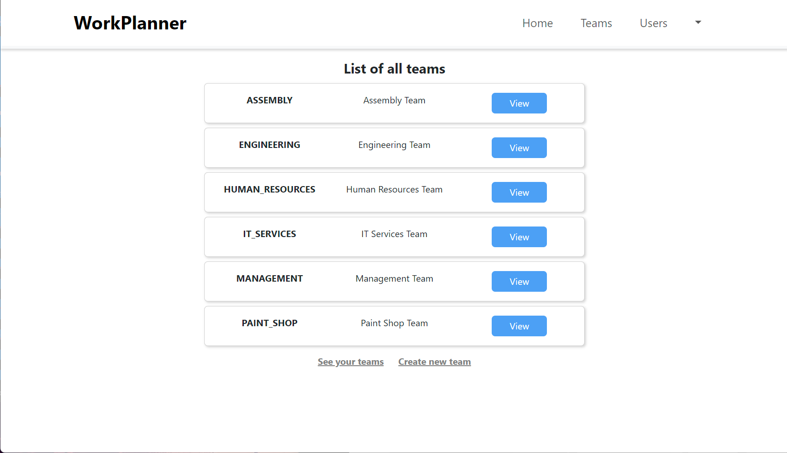

# WorkPlanner Application

A full-stack web application designed to help teams and individuals plan and manage work effectively. WorkPlanner provides features like user and team management, task assignment and a calendar-based overview of work schedules. It is built with a Spring Boot and Hibernate backend and a React Bootstrap frontend.

## Table of Contents
* [Key features](#key-features)
* [Technologies](#technologies)
* [Demo](#demo)
* [Site](#site)
* [Setup](#setup)
* [Future plans](#future-plans)
* [License](#license)

## Key features

* **User and Team Management**: Create, update and delete users and teams.
* **Role Assignment**: Assign roles like team leader and manage team members.
* **Task Planning**: Assign tasks to individual team members.
* **Calendar View**: Display a calendar-based work schedule for each user or team.
* **Authentication and Authorization**: Secure login using JWT tokens.

## Technologies

**Frontend**: 
  - **React** 18.3.1
  - **React Bootstrap** 2.10.4 (for UI components)
  - **Bootstrap** 5.3.3 (for styling)
  - **React Router DOM** 6.26.1 (for navigation)
  - **Axios** 1.7.7 (for HTTP requests)
  - **JWT Decode** 4.0.0 (for handling JWTs)
  - **React Calendar Timeline** 0.28.0 (for displaying schedules)
  - **JQuery** 3.7.1 (for additional DOM manipulation)

**Backend**:
  - **Java**: Spring Boot 3.3.2 (REST API)
  - **Security**: Spring Boot Security, OAuth2 Resource Server with JWT (JSON Web Token) authentication
  - **ORM**: Spring Data JPA with Hibernate
  - **Database**: H2 (in-memory)
  - **Validation**: Spring Boot Starter Validation
  - **Utilities**: Lombok and ModelMapper

**Testing**: 
  - **JUnit 5** and **MockMvc** with Spring Boot Starter Test
  - **Spring Security Test** for security-related testing

**Deployment**: 
  -  **Netlify** (Frontend), **Heroku** (Backend)

## Demo

You can try the live demo of the app here:

* [Frontend](https://workplanner-app.netlify.app/)
* [Backend](https://workplanner-app-39998a80d877.herokuapp.com/)

Demo credentials:
* **Admin role**: admin/admin   
* **User role**: jankow/ABC123
 
*Webapp database is restored to its default state at every full hour.* 

## Site

#### Login Page


#### Register Page


#### Home Page


#### Teams List


#### Team Page


#### Add Member Page


#### Users List


#### User Page


## Setup

### Prerequisites
- Java 17 or later
- Node.js and npm (for frontend)
- Maven (for backend)

### Backend Setup
Clone the repository:

```bash
git clone https://github.com/yourusername/workplanner-backend.git
cd workplanner-backend
```

No need to configure an external database! The application uses an in-memory H2 database, which is automatically configured.

Run the backend application using Maven:

```bash
mvn spring-boot:run
```
To access the H2 console for debugging purposes, navigate to http://localhost:8080/h2-console and use the following settings:

- JDBC URL: jdbc:h2:mem:workplannerdb
- Username: sa
- Password: [leave it blank]

### Frontend Setup

Clone the frontend repository:

```bash
git clone https://github.com/yourusername/workplanner-frontend.git
cd workplanner-frontend
```
Install the dependencies:

```bash
npm install
```

Start the frontend application:

```bash
npm start
```
### Running Locally

Open your browser and navigate to http://localhost:3000 for the frontend.  
Backend API will run on http://localhost:8080.

## Future plans

- Functionality to monitor and highlight potential plan entry's conflicts

## Contributing

Pull requests are welcome. For major changes, please open an issue first
to discuss what you would like to change.

Please make sure to update tests as appropriate.

## License

[MIT](https://choosealicense.com/licenses/mit/)
